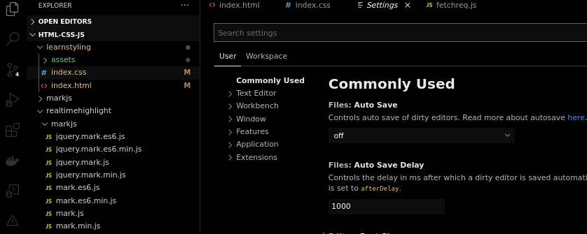
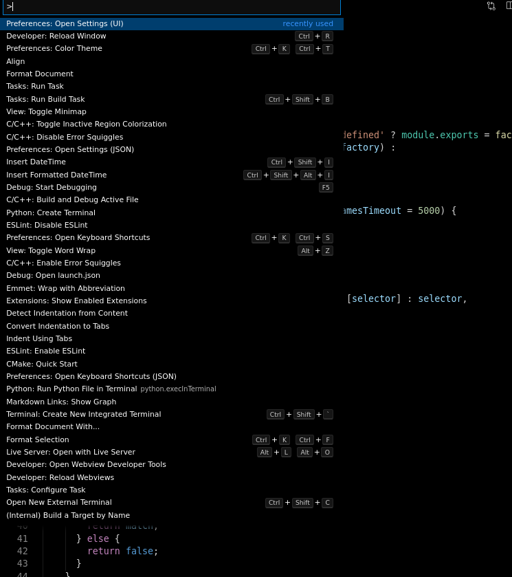

# VS Code Vanta Black Color Theme 

## Mostly similar to [Pitch Black Theme](https://github.com/ViktorQvarfordt/vscode-pitch-black-theme)

> In the beginning God created the heaven and the earth.

> And the earth was without form, and void; and darkness was upon the face of the deep. 

> And the Spirit of God moved upon the face of the waters.

> And God said, ~~Let there be light: and there was light.~~ I like dark theme

## Screenshot

### Editor window


---

### Settings


---

### Command Pallete

---


## Manual Install

```
cd ~/.vscode/extensions
git clone https://github.com/neelabalan/vscode-vantablack-theme.git vanta-black-theme
```

#### or

Launch VS Code Quick Open (Ctrl+P), paste the following command, and press enter

`ext install neelabalan.vscode-vantablack-theme`


## Thanks to [Viktor Qvarfordt](https://github.com/ViktorQvarfordt)
